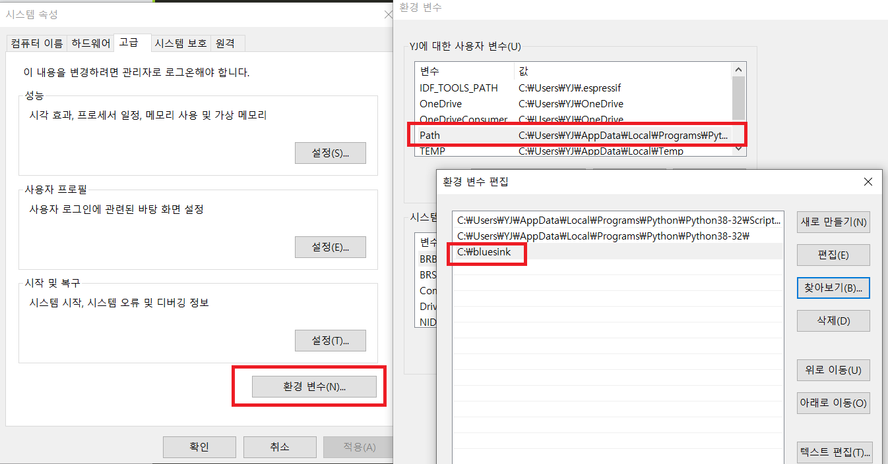

Install
=======

Window
------
BLUESINK의 모든 윈도우 소프트웨어는 편의상 ``C:\bluesink`` 폴더에서 관리한다. 따라서 먼저 ``C:\`` 위치에 ``bluesink`` 폴더가 없다면 만들어 주자.

.. code-block:: bat

    #> cd C:\
    C:\>md bluesink
    C:\>cd bluesink

그 다음, 아래와 같이 소스코드를 가져온다.

.. code-block:: bat

    C:\bluesink> git clone https:\\bitbucket.org\bluesink\odgen.git
    C:\bluesink> cd odgen

다음의 명령어를 통해 dependancy package들을 설치하고, install 스크립트로 시스템에 명령어를 설치한다. install 스크립트를 실행하면 odgen 하위 폴더에 ``ODgen.bat`` 의 윈도우 배치 파일이 생성된다.

.. code-block:: bat

    C:\bluesink\odgen> pip install -r requirements.txt
    C:\bluesink\odgen> python install.py 

마지막으로, 윈도우 환경 변수로 ``C:\bluesink`` 주소를 등록해 주어야, 커맨드 창에서 번거로움 없이 명령어를 실행 시킬 수 있다. 따라서 윈도우 환경 변수에 해당 경로를 등록해 주자.

모든 과정이 완료 되었다면, 커맨드 창을 새로 켠 다음에, ``ODgen`` 명령어를 쳐서 다음과 같이 나오면 설치가 완료된 것이다.

.. code-block:: bat

    #> ODgen
    Input argument is invalid
    Usage :
    	ODgen <input_edsfile_path> <output_folder_path>

.. toctree::
    :hidden: